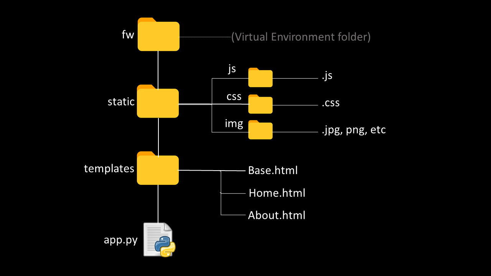

# Proyecto de Referenciación en Flask

Este proyecto tiene como objetivo proporcionar ejemplos y revisar conceptos en el desarrollo web utilizando Flask y otras tecnologías. Proporciona ejemplos prácticos de programación en Python, así como el uso de tecnologías como Apache, JavaScript, CSS y HTML.

## Tecnologías Utilizadas

El proyecto utiliza las siguientes tecnologías:

- Python :snake:
- Flask :rocket:
- Apache :globe_with_meridians:
- JavaScript :computer:
- CSS :art:
- HTML :memo:

## Autor

**Nombre del Autor**
- Sitio web: [https://j4vj4r.github.io/javierjaramillo.github.io/](https://j4vj4r.github.io/javierjaramillo.github.io/)
- GitHub: [@j4vj4r](https://github.com/j4vj4r)
- Twitter: [@jaradeveloper](https://twitter.com/jaradeveloper)
- LinkedIn: [Javier Jaramillo](https://www.linkedin.com/in/javier-fullstack/)

## Ejemplo de Aplicación

Aquí puedes ver una captura de pantalla de la aplicación en funcionamiento:

## Contribuciones

¡Las contribuciones son bienvenidas! Si deseas contribuir a este proyecto, por favor realiza un fork y envía tus pull requests.

## Licencia

Este proyecto está licenciado bajo la [Licencia MIT](LICENSE).
